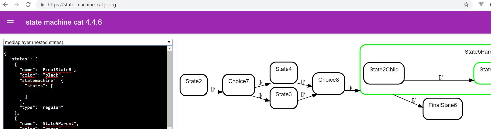

# stama-visualizer
Showing the current state of your Spring state machine with State Machine Cat

## Using

* https://github.com/sverweij/state-machine-cat
* Spring State Machine Uml
* Model created with Eclipse Papyrus

## Output

