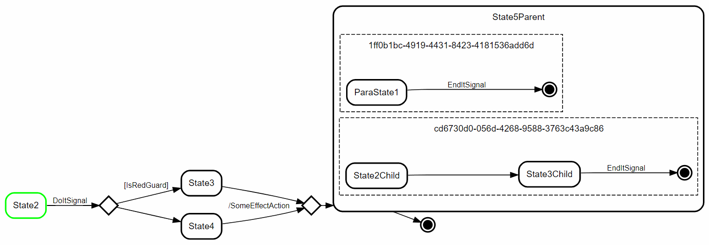

# State of this project

This is currently in experimentation phase. 
Once the example is working it will be split 
in a library and an example project.
(And probably most of the code re-written 🙈)

# StaMa-Visualizer
Showing the current state of your Spring state machine with State Machine Cat

## Using

* https://github.com/sverweij/state-machine-cat
* Spring Statemachine (UML)
* Model created with Eclipse Papyrus

# TODOs

* [x] support regions
* [ ] support region names
* [ ] support forks & joins

## Output

